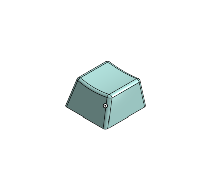
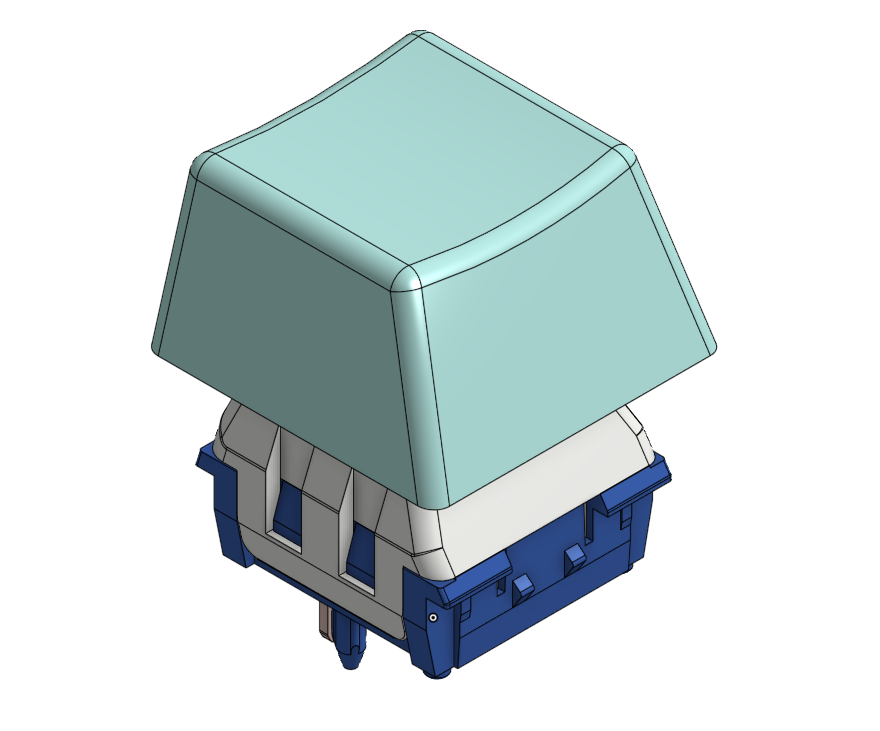

This file contains all of the CAD done for the project. I use Onshape for this, so there are not actual files here. I have made seperate projects for the keycaps, and the keyboard. The link for each project is below:

### [Keycaps](https://cad.onshape.com/documents/d4fd816728e9164d561f8a3b/w/529fabd357803320528d8e3d/e/7d6b72805a35d30e3a9b434e?renderMode=0&uiState=6998c6c4af19a35d394b04ad)

### [KeyBoard](https://cad.onshape.com/documents/8e392373317b56167f8e0f06/w/db68d71c3ccb40ce789a09d5/e/fd6ff56c9ada31cb565cc635?renderMode=0&uiState=6998c809c695e4f439da27f8)
